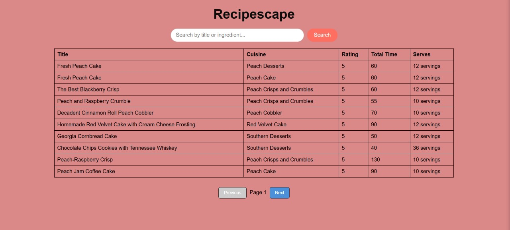
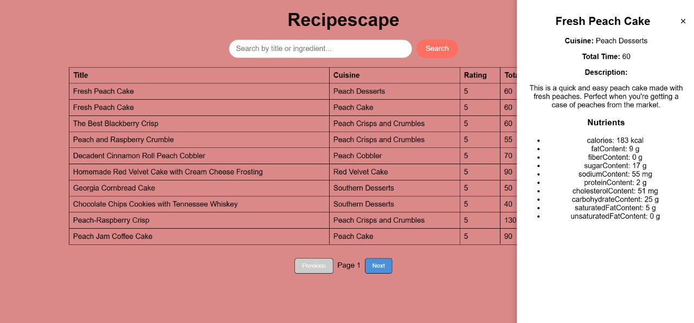

# RecipeScape

RecipeScape is a web-based application that allows users to browse, search, and view detailed information about recipes. It includes features like **pagination**, **search by title or cuisine**, and a **drawer view** for detailed recipe information.

## Folder Structure
```
Recipe/
├── backend/         # Node.js/Express backend code
├── frontend/        # HTML, CSS, JS frontend
├── database/        # SQL scripts or DB setup files
├── screenshots/     # Demo screenshots
└── README.md        # Project documentation
```

---

## Features

* Display recipes in a **table view**.
* **Pagination** for browsing large datasets.
* **Search functionality** by recipe title or cuisine.
* **Drawer view** to see detailed information about a recipe including nutrients.
* Clean UI with hover effects on table rows.

---

## Technologies Used

* **Frontend:** HTML, CSS, JavaScript
* **Backend:** Node.js, Express.js
* **Database:** PostgreSQL (or your preferred DBMS)
* **Other:** Fetch API for connecting frontend to backend

---

## Setup Instructions

### 1. Database

1. Create a PostgreSQL database (or use the provided SQL scripts in `database/` folder).
2. Run the SQL scripts to create the `recipes` table and insert sample data.

---

### 2. Backend

1. Open terminal inside `backend/` folder.
2. Install dependencies:

```bash
npm install
```

3. Create a `.env` file with database credentials:

```
DB_USER=your_db_user
DB_HOST=localhost
DB_DATABASE=your_db_name
DB_PASSWORD=your_password
DB_PORT=5432
PORT=4000
```

4. Start backend server:

```bash
npm run dev
```

Server will run at: `http://localhost:4000`

---

### 3. Frontend

1. Open `frontend/index.html` in your browser.
2. Make sure backend server is running.
3. You should see the recipe table with pagination and search.

---

### 4. Search

* Enter a recipe name or cuisine in the search box and click **Search**.
* The table will update with matching results.
* Pagination is disabled while viewing search results.

---

### 5. Drawer (Detailed View)

* Click any row in the table to see recipe details in a drawer from the right.
* Drawer includes **title, cuisine, total time, description, and nutrients**.
* Close the drawer using the `×` button.

---

## Screenshots / Demo

### Recipe Table View



### Recipe Drawer View



---

## Notes

* Ensure your backend is running before using the frontend.
* If no recipes are found, the table displays “No recipes found.”
* Pagination and search work together; search disables pagination temporarily.

---

